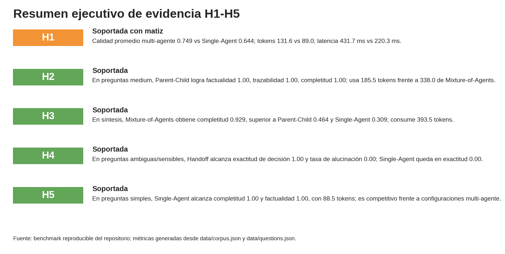
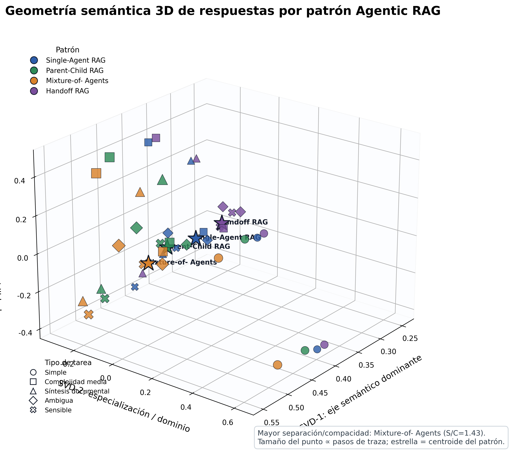

# Agentic RAG Business Patterns

Este repositorio contiene un **harness experimental reproducible** para defender hipótesis sobre patrones multi-agente aplicados a RAG empresarial. El proyecto compara un baseline **Single-Agent RAG** contra **Parent-Child**, **Mixture-of-Agents** y **Handoff**, midiendo factualidad, claridad, trazabilidad, completitud, alucinaciones, latencia y consumo de tokens. El diseño se apoya en la literatura de RAG, agentes autónomos y mezclas de agentes [1] [2] [3].

> El objetivo no es maximizar una métrica aislada, sino estimar cuándo conviene usar orquestación multi-agente y cuándo un RAG mono-agente bien afinado es suficiente.

## Hipótesis evaluadas

| Hipótesis | Resultado esperado evaluable | Evidencia generada |
|---|---|---|
| H1 | Los patrones multi-agente mejoran calidad y trazabilidad frente a Single-Agent, con mayor coste. | `results/aggregate_metrics.csv`, radar de calidad y frontera coste-latencia. |
| H2 | Parent-Child ofrece el mejor equilibrio en complejidad media. | `balanced_index` y métricas filtrables por `question_type=medium`. |
| H3 | Mixture-of-Agents mejora completitud en síntesis, con más latencia y tokens. | `completeness_by_question_type.png` y métricas agregadas. |
| H4 | Handoff mejora preguntas ambiguas, sensibles o multi-dominio mediante transferencia o rechazo. | `decision_accuracy`, `hallucination_rate` y trazas por respuesta. |
| H5 | Single-Agent es competitivo en preguntas simples y de bajo riesgo con menor coste. | Detalle por `question_type=simple` en `detailed_metrics.csv`. |

## Instalación

```bash
python -m venv .venv
source .venv/bin/activate
pip install -e .[dev]
```

También puede ejecutarse directamente en un entorno con dependencias instaladas:

```bash
pip install -e .
python scripts/run_experiment.py
```

## Ejecución del benchmark

```bash
agentic-rag-experiment run --output-dir results
```

El comando genera métricas detalladas, métricas agregadas, respuestas trazadas y figuras listas para incluir en un producto científico.

| Archivo | Contenido |
|---|---|
| `results/detailed_metrics.csv` | Métrica por pregunta y patrón. |
| `results/aggregate_metrics.csv` | Métricas promedio por patrón e índices compuestos. |
| `results/answers.csv` | Respuestas, citas, hechos usados y trazas. |
| `results/figures/*.png` | Visualizaciones base publicables. |
| `paper_visuals/` | Capa editorial con gráficos científicos estilizados, métricas matemáticas de coste y geometría semántica 3D. |
| `paper_visuals/tables/paper_cost_metrics.csv` | Tabla de coste compuesto, utilidad neta, eficiencia de tokens y eficiencia temporal. |
| `paper_visuals/tables/paper_semantic_geometry_metrics.csv` | Tabla de compacidad, separación, desplazamiento semántico y cociente geométrico por patrón. |
| `papr-segments/` | Segmentos Markdown independientes para integrar método, pipeline, evaluación, coste y resultados en el paper. |
| `docs/final_report.md` | Interpretación científica de H1-H5. |

## Resultados principales

La ejecución incluida en este repositorio soporta las cinco hipótesis de trabajo. En promedio, los patrones multi-agente alcanzan mayor índice de calidad que Single-Agent, aunque Parent-Child y Mixture-of-Agents incrementan latencia y tokens. Handoff sobresale cuando la respuesta correcta es pedir aclaración o rechazar una instrucción sensible.

| Hipótesis | Veredicto | Evidencia resumida |
|---|---|---|
| H1 | Soportada con matiz | Calidad multi-agente 0.749 vs Single-Agent 0.644; tokens 131.6 vs 89.0; latencia 431.7 ms vs 220.3 ms. |
| H2 | Soportada | En tareas medium, Parent-Child logra factualidad, trazabilidad y completitud de 1.00 con 185.5 tokens, frente a 338.0 de Mixture-of-Agents. |
| H3 | Soportada | En síntesis, Mixture-of-Agents alcanza completitud 0.929, superior a Parent-Child 0.464 y Single-Agent 0.309. |
| H4 | Soportada | En ambiguas/sensibles, Handoff logra exactitud de decisión 1.00 y alucinación 0.00. |
| H5 | Soportada | En preguntas simples, Single-Agent logra factualidad y completitud 1.00 con coste bajo. |



## Soporte matemático y visual para paper

Además de las salidas base en `results/`, el repositorio incluye una carpeta dedicada a visualización científica: [`paper_visuals/`](paper_visuals/). Esta capa transforma los resultados del benchmark en figuras de alto impacto a 300 dpi y tablas matemáticas citables. El coste operativo compuesto se define como \(C_p = 0.4\hat{T}_p + 0.4\hat{L}_p + 0.2\hat{S}_p\), donde \(\hat{T}_p\) representa tokens normalizados, \(\hat{L}_p\) latencia normalizada y \(\hat{S}_p\) complejidad de traza normalizada. La utilidad neta se define como \(U_p = Q_p - 0.35C_p\), lo cual permite discutir calidad bajo penalización operacional.

| Entregable | Uso en el paper |
|---|---|
| `paper_visuals/figures/paper_cost_quality_frontier.png` | Frontera calidad-coste para defender H1, H2 y H3. |
| `paper_visuals/figures/paper_net_utility.png` | Selección comparativa usando utilidad penalizada por coste. |
| `paper_visuals/figures/paper_semantic_embedding_3d.png` | Visualización 3D de geometría semántica por patrón agentic. |
| `paper_visuals/figures/paper_semantic_geometry_metrics.png` | Comparación matemática de separación y compacidad semántica. |
| `paper_visuals/tables/paper_semantic_embeddings_3d.csv` | Coordenadas reproducibles por respuesta para auditoría y reuso. |

La geometría semántica se calcula de forma determinista sobre preguntas, respuestas, decisiones, citas, hechos y trazas reales del benchmark usando representación TF-IDF con n-gramas y reducción SVD a tres dimensiones, una técnica estándar para reducir matrices texto-documento de alta dimensionalidad en análisis semántico latente [5]. Para cada patrón se reporta compacidad intra-patrón, separación inter-centroide, desplazamiento respecto al baseline Single-Agent y el cociente \(S/C\). En la ejecución incluida, Mixture-of-Agents obtiene el mayor cociente de separación/compacidad \(S/C = 1.43\), seguido por Parent-Child \(S/C = 1.25\), Handoff \(S/C = 1.14\) y Single-Agent \(S/C = 1.07\), lo que aporta soporte geométrico adicional a la hipótesis de especialización semántica inducida por los patrones multi-agente.



El análisis completo está en [`docs/final_report.md`](docs/final_report.md), la especificación matemática está en [`docs/cost_model_and_visual_spec.md`](docs/cost_model_and_visual_spec.md), y las tablas reproducibles están en [`results/`](results/) y [`paper_visuals/tables/`](paper_visuals/tables/).

## Segmentos independientes para el paper

La carpeta [`papr-segments/`](papr-segments/) contiene cinco archivos Markdown independientes y detallados para acelerar la redacción del producto científico. Estos segmentos cubren el marco experimental y corpus, la implementación de los harness, la metodología de evaluación, las ecuaciones de coste y eficiencia, y la narrativa de resultados con visualizaciones y citas. Cada segmento incluye tablas, ecuaciones, referencias académicas y vínculos operativos hacia los resultados reproducibles del repositorio.

| Segmento | Archivo |
|---|---|
| Marco experimental y corpus | [`papr-segments/01_marco_experimental_y_corpus.md`](papr-segments/01_marco_experimental_y_corpus.md) |
| Implementación de harness y pipeline | [`papr-segments/02_implementacion_harness_pipeline.md`](papr-segments/02_implementacion_harness_pipeline.md) |
| Metodología de evaluación y métricas | [`papr-segments/03_metodologia_evaluacion_metricas.md`](papr-segments/03_metodologia_evaluacion_metricas.md) |
| Ecuaciones de coste y eficiencia | [`papr-segments/04_ecuaciones_coste_eficiencia.md`](papr-segments/04_ecuaciones_coste_eficiencia.md) |
| Resultados, visualizaciones y citas | [`papr-segments/05_resultados_visualizaciones_citas.md`](papr-segments/05_resultados_visualizaciones_citas.md) |

## Arquitectura

```text
data/corpus.json + data/questions.json
        │
        ▼
KeywordRetriever ──► Single-Agent RAG
        │            Parent-Child RAG
        │            Mixture-of-Agents RAG
        │            Handoff RAG
        ▼
Métricas reproducibles ──► CSV + visualizaciones + reporte
```

## Principales decisiones técnicas

El proyecto usa recuperación lexical determinista y generación extractiva controlada por hechos para que las conclusiones sean **auditables y repetibles**. Esta aproximación evita que variaciones externas de un proveedor LLM alteren los resultados experimentales y facilita prácticas de gestión de riesgo alineadas con marcos de gobierno de IA [4]. En una fase posterior, el mismo harness puede conectarse a modelos reales manteniendo las mismas interfaces de evaluación.

## Referencias

[1]: https://arxiv.org/abs/2005.11401 "Retrieval-Augmented Generation for Knowledge-Intensive NLP Tasks"
[2]: https://arxiv.org/abs/2402.01680 "Mixture-of-Agents Enhances Large Language Model Capabilities"
[3]: https://arxiv.org/abs/2308.08155 "A Survey on Large Language Model based Autonomous Agents"
[4]: https://www.nist.gov/itl/ai-risk-management-framework "NIST AI Risk Management Framework"
[5]: https://doi.org/10.1137/1.9780898719769.ch5 "Latent Semantic Indexing via Singular Value Decomposition"
