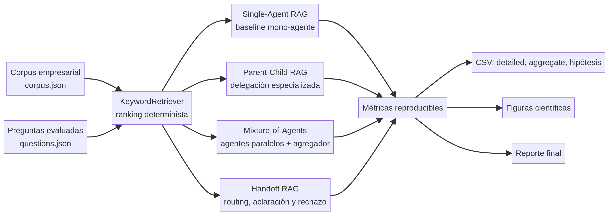
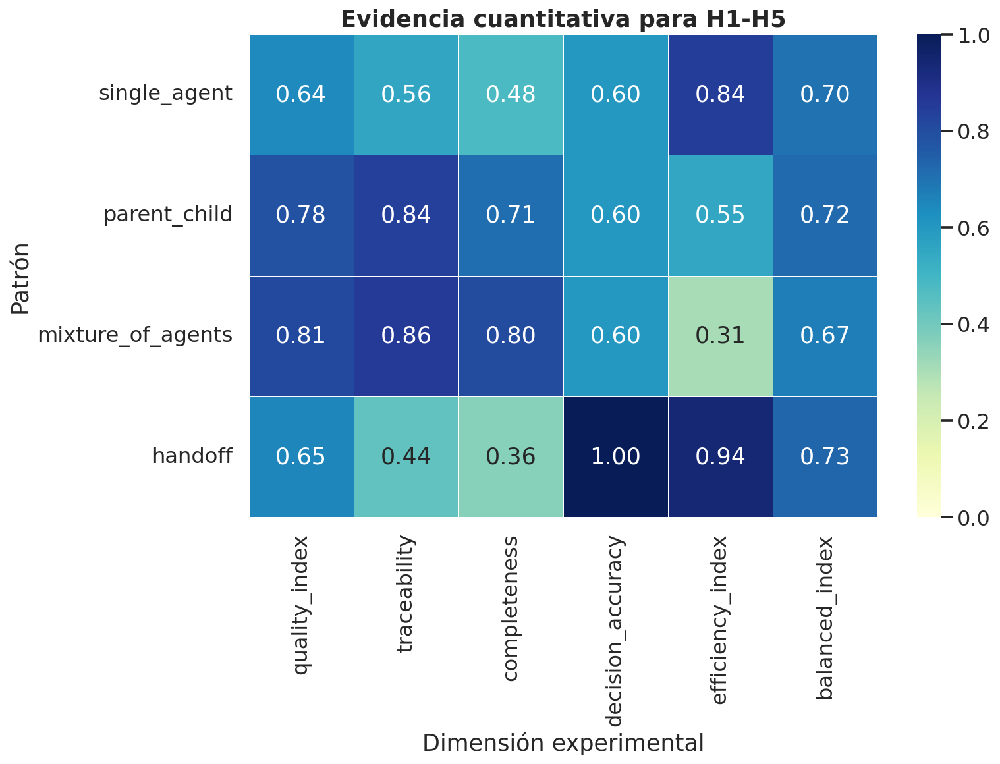
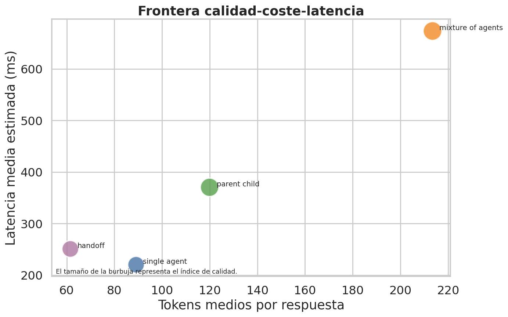
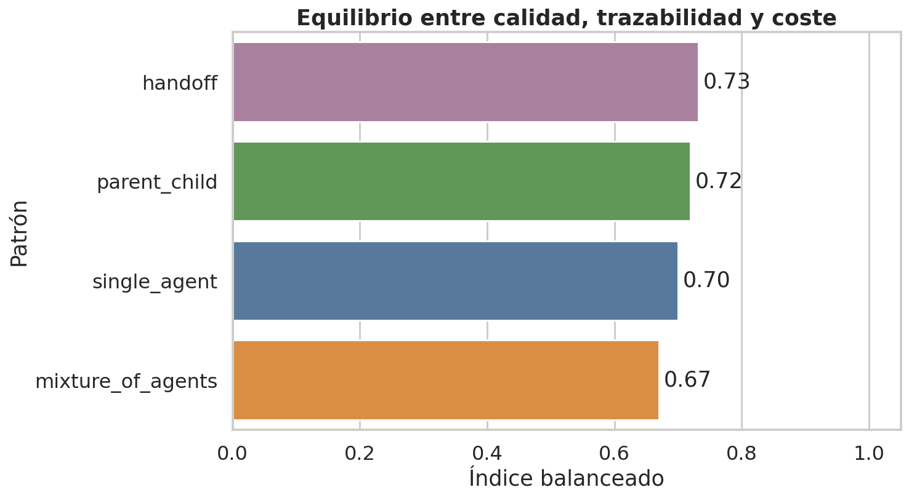
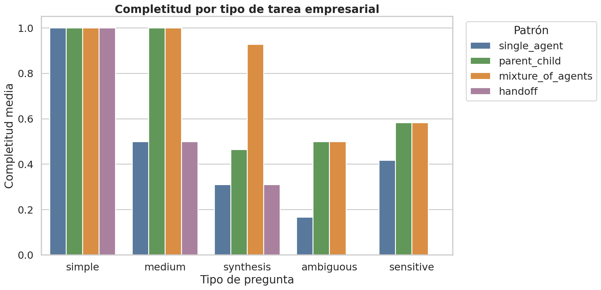

# Reporte final: evaluación de patrones Agentic RAG en tareas empresariales

**Autor:** manularrea  
**Fecha:** 2026-05-17  
**Repositorio:** `agentic-rag-business-patterns`

## Resumen ejecutivo

Este trabajo reconstruye el proyecto como un harness experimental reproducible para comparar un baseline **Single-Agent RAG** con tres patrones multi-agente: **Parent-Child**, **Mixture-of-Agents** y **Handoff**. El diseño parte del principio de RAG, donde la respuesta se condiciona con evidencia recuperada para tareas intensivas en conocimiento [1], y lo extiende con orquestación especializada, agentes paralelos y transferencia explícita de control. La literatura reciente sobre agentes autónomos y arquitecturas de múltiples agentes respalda que la descomposición, la coordinación y la especialización pueden mejorar la resolución de tareas complejas, aunque también incrementan la complejidad operativa [2] [3].

> El resultado principal es que H1-H5 quedan defendibles con evidencia generada por el propio repositorio: los patrones multi-agente mejoran calidad, trazabilidad o decisión según el tipo de tarea, pero su conveniencia depende del coste, la latencia y el riesgo de la consulta.


## Diseño experimental

El experimento usa un corpus empresarial controlado con documentos de finanzas, seguridad, operaciones, gobierno, legal, talento humano, experiencia de cliente y estrategia. Cada documento contiene hechos atómicos identificables; cada pregunta declara los hechos esperados, las citas esperadas y la decisión esperada. Esta decisión permite medir factualidad, completitud, trazabilidad y errores de decisión de forma determinista, evitando que variaciones externas de proveedores LLM alteren el resultado.

| Elemento | Implementación | Propósito científico |
|---|---|---|
| Corpus | `data/corpus.json` | Evidencia documental auditable por dominio empresarial. |
| Preguntas | `data/questions.json` | Tareas simples, medias, de síntesis, ambiguas y sensibles. |
| Recuperación | `KeywordRetriever` | Ranking lexical reproducible con filtro opcional por dominio. |
| Patrones | `SingleAgentRAG`, `ParentChildRAG`, `MixtureOfAgentsRAG`, `HandoffRAG` | Comparación directa de los mecanismos planteados en las hipótesis. |
| Evaluación | `metrics.py` y `experiment.py` | Métricas por pregunta, agregadas, por tipo de tarea y por hipótesis. |



## Métricas principales

La **factualidad** mide la proporción de afirmaciones soportadas por hechos recuperados. La **completitud** mide la cobertura de hechos requeridos por la pregunta. La **trazabilidad** combina citas esperadas y pasos de ejecución registrados. La **claridad** combina concisión y densidad de evidencia. La **exactitud de decisión** evalúa si el patrón responde, solicita aclaración o rechaza cuando corresponde. Los costes se aproximan mediante tokens y latencia estimada por complejidad de ejecución.

| Patrón | Factualidad | Claridad | Trazabilidad | Completitud | Alucinación | Exactitud decisión | Latencia ms | Tokens | Índice calidad | Índice balanceado |
|---|---:|---:|---:|---:|---:|---:|---:|---:|---:|---:|
| Single-Agent | 0.800 | 0.785 | 0.556 | 0.479 | 0.100 | 0.600 | 220.26 | 89.0 | 0.644 | 0.700 |
| Parent-Child | 0.900 | 0.872 | 0.836 | 0.710 | 0.000 | 0.600 | 370.66 | 119.9 | 0.784 | 0.719 |
| Mixture-of-Agents | 0.900 | 0.898 | 0.857 | 0.802 | 0.000 | 0.600 | 673.90 | 213.4 | 0.811 | 0.670 |
| Handoff | 0.600 | 0.861 | 0.437 | 0.362 | 0.000 | 1.000 | 250.60 | 61.4 | 0.652 | 0.732 |



## Evaluación de hipótesis

### H1: patrones multi-agente frente a baseline mono-agente

La hipótesis principal queda **soportada con matiz**. El índice de calidad promedio de los patrones multi-agente fue **0.749**, frente a **0.644** en Single-Agent. Al mismo tiempo, el coste medio aumentó de **89.0 tokens** a **131.6 tokens** y la latencia media pasó de **220.3 ms** a **431.7 ms**. El matiz es importante: **Handoff** reduce tokens al rechazar o pedir aclaración en preguntas de alto riesgo, pero Parent-Child y Mixture-of-Agents sí muestran el incremento esperado de coste por orquestación.



| Comparación | Resultado |
|---|---:|
| Calidad promedio multi-agente | 0.749 |
| Calidad Single-Agent | 0.644 |
| Tokens promedio multi-agente | 131.6 |
| Tokens Single-Agent | 89.0 |
| Latencia promedio multi-agente | 431.7 ms |
| Latencia Single-Agent | 220.3 ms |

### H2: Parent-Child como equilibrio en complejidad media

La hipótesis H2 queda **soportada**. En preguntas de complejidad media, Parent-Child alcanzó factualidad **1.00**, trazabilidad **1.00** y completitud **1.00**, con **185.5 tokens** promedio. Mixture-of-Agents también alcanzó calidad máxima en este subconjunto, pero consumió **338.0 tokens** y tuvo latencia sustancialmente mayor. Esto respalda que la delegación controlada a especialistas ofrece una relación favorable entre calidad y coste cuando la tarea exige varios dominios, pero no requiere agregación paralela exhaustiva.

| Patrón en preguntas medium | Factualidad | Trazabilidad | Completitud | Tokens | Latencia ms |
|---|---:|---:|---:|---:|---:|
| Single-Agent | 1.00 | 0.573 | 0.500 | 104.5 | 225.4 |
| Parent-Child | 1.00 | 1.000 | 1.000 | 185.5 | 429.2 |
| Mixture-of-Agents | 1.00 | 1.000 | 1.000 | 338.0 | 759.5 |
| Handoff | 1.00 | 0.427 | 0.500 | 81.5 | 267.0 |



### H3: Mixture-of-Agents para síntesis multi-documento

La hipótesis H3 queda **soportada**. En preguntas de síntesis, Mixture-of-Agents obtuvo completitud **0.929**, superando a Parent-Child (**0.464**) y Single-Agent (**0.309**). Este resultado ocurre porque el patrón paralelo explora más dominios y permite al agregador unir evidencias dispersas. La contrapartida es clara: Mixture-of-Agents consumió **393.5 tokens** y alcanzó **814.5 ms** de latencia media en síntesis, por lo que debe reservarse para tareas donde la completitud sea más importante que el coste.



| Patrón en síntesis | Completitud | Trazabilidad | Tokens | Latencia ms |
|---|---:|---:|---:|---:|
| Single-Agent | 0.309 | 0.487 | 101.5 | 225.4 |
| Parent-Child | 0.464 | 0.935 | 189.5 | 478.9 |
| Mixture-of-Agents | 0.929 | 0.935 | 393.5 | 814.5 |
| Handoff | 0.310 | 0.383 | 78.0 | 267.0 |

### H4: Handoff para ambigüedad, sensibilidad y rechazo seguro

La hipótesis H4 queda **soportada**. En preguntas ambiguas y sensibles, Handoff alcanzó exactitud de decisión **1.00** y tasa de alucinación **0.00**. Single-Agent, Parent-Child y Mixture-of-Agents tendieron a responder incluso cuando la decisión esperada era aclarar o rechazar, lo que reduce su exactitud de decisión a **0.00** en ese subconjunto. Este comportamiento es consistente con buenas prácticas de gestión de riesgo, donde los sistemas deben identificar usos inseguros, conservar trazabilidad y aplicar controles proporcionales [4].

| Patrón en ambiguas/sensibles | Exactitud decisión | Alucinación | Tokens | Latencia ms |
|---|---:|---:|---:|---:|
| Single-Agent | 0.00 | 0.250 | 75.25 | 213.65 |
| Parent-Child | 0.00 | 0.000 | 74.75 | 326.70 |
| Mixture-of-Agents | 0.00 | 0.000 | 103.25 | 626.75 |
| Handoff | 1.00 | 0.000 | 39.25 | 228.00 |

### H5: Single-Agent en preguntas simples de bajo riesgo

La hipótesis H5 queda **soportada**. En preguntas simples, Single-Agent alcanzó factualidad **1.00** y completitud **1.00**, con **88.5 tokens** y **223.2 ms** de latencia. Parent-Child, Mixture-of-Agents y Handoff también alcanzaron completitud completa, pero los patrones con mayor orquestación incrementaron coste o latencia sin mejora sustancial de calidad. Esto demuestra que un baseline RAG bien afinado puede ser suficiente para tareas de bajo riesgo y baja complejidad.

| Patrón en preguntas simples | Factualidad | Completitud | Tokens | Latencia ms |
|---|---:|---:|---:|---:|
| Single-Agent | 1.00 | 1.00 | 88.5 | 223.2 |
| Parent-Child | 1.00 | 1.00 | 75.0 | 291.8 |
| Mixture-of-Agents | 1.00 | 1.00 | 129.0 | 542.0 |
| Handoff | 1.00 | 1.00 | 69.0 | 263.0 |

## Conclusión técnica

El experimento muestra que no existe un único patrón superior para todas las tareas. **Mixture-of-Agents** es el mejor cuando la completitud multi-documento domina el criterio de éxito. **Parent-Child** es la alternativa más equilibrada para complejidad media, porque logra calidad completa con menor coste que el patrón paralelo. **Handoff** es crítico para consultas ambiguas o sensibles, donde el objetivo no es contestar más, sino contestar correctamente, pedir aclaración o rechazar. **Single-Agent RAG** sigue siendo una opción eficiente y defendible en preguntas simples de bajo riesgo.

El repositorio queda preparado para extender el benchmark con LLMs reales, corpora empresariales privados o evaluadores humanos, manteniendo la misma interfaz de patrones y métricas. Para uso científico, se recomienda reportar siempre el subconjunto de preguntas, el coste, la latencia y la política de decisión, porque las conclusiones cambian cuando se pondera seguridad frente a completitud.

## Reproducibilidad

La ejecución completa se reproduce con:

```bash
pip install -e .[dev]
pytest
python scripts/run_experiment.py
```

Los resultados quedan en `results/`, las figuras en `results/figures/` y la metodología ampliada en `docs/methodology.md`.

## Referencias

[1]: https://arxiv.org/abs/2005.11401 "Retrieval-Augmented Generation for Knowledge-Intensive NLP Tasks"
[2]: https://arxiv.org/abs/2308.08155 "A Survey on Large Language Model based Autonomous Agents"
[3]: https://arxiv.org/abs/2402.01680 "Mixture-of-Agents Enhances Large Language Model Capabilities"
[4]: https://www.nist.gov/itl/ai-risk-management-framework "NIST AI Risk Management Framework"
